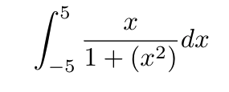

# FunLabs
Coding some stuff just for fun

This repo contains some codes that I enjoy conding.

For now, we have:

- Integral calculator based on input from the user, it also generates a chart

### How to use

#### Integral

```golang
  result := DiscreteIntegral{}
	result.Intervals = 1000
	result.Function = "x / (1 + (x^2))"
	result.InitialX = -5
	result.EndX = 5

	integral := result.Calculate()
  fmt.Println(integral)
```

This will make:


**Known Issues**: The `^` operator has problems with precendence. If you intend to use it, make sure to use parenthesis.


### TODO

- Refactor methods
- Make some tests
